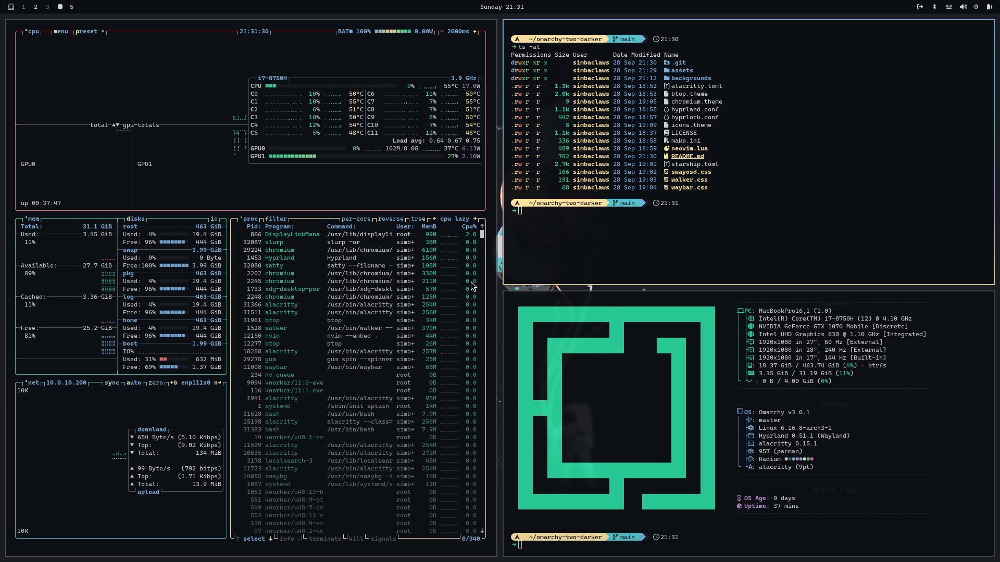
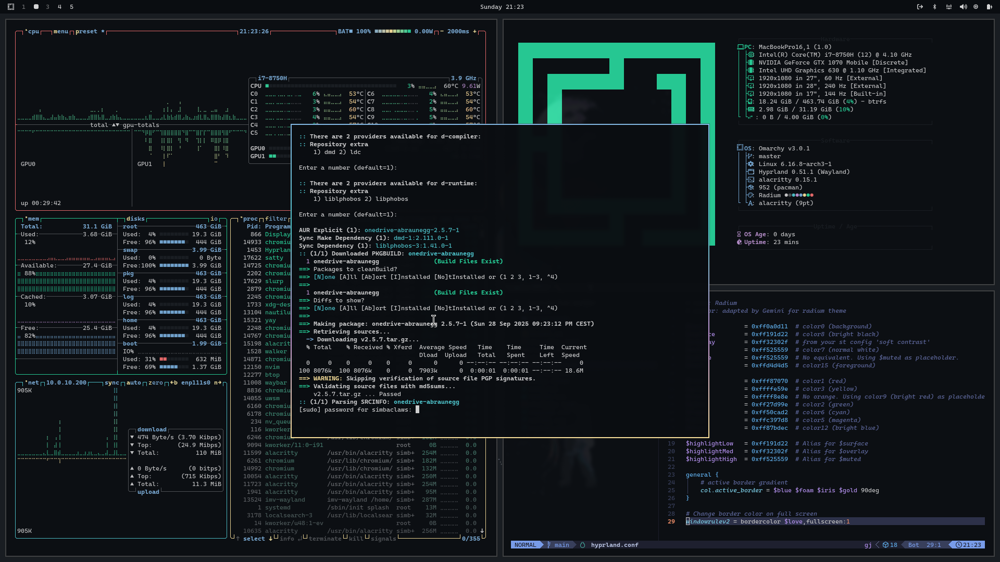

# Radium Theme for Omarchy


A collection of configuration files to bring the Radium colorscheme to [Omarchy](https://omarchy.org/) and its related applications.

### Screenshots:




### Prompt:

The included [Starship](https://starship.rs) prompt provides a matching look and feel. To use it, copy the `starship.toml` file from this repository to your `~/.config` folder.

### Font:
This theme was designed with the [SauceCodePro](https://www.nerdfonts.com/font-downloads) Nerd Font in mind.

## Installation

Use the built-in installation script (available after version 1.4.0):

```bash
omarchy-theme-install https://github.com/color-schemes/omarchy-radium
